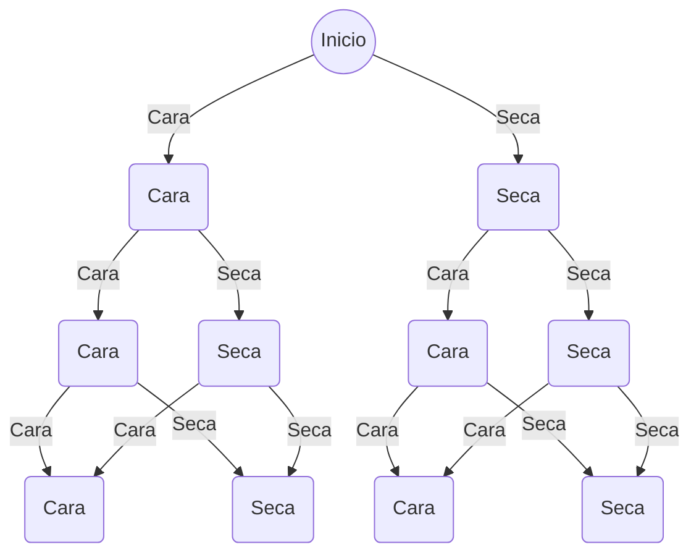

# MECC
- teoria: 
   * horarios: lunes 16 a 18
   * miercoles 16 a 18
- practica:
   * lunes 14 a 16
- consulta virtual 
   * miercoles 19 a 20:30

* profesores: 
   - silvina Pistonesi 
- fechas: 
  - 1° parcial: 18/9
  - 2° parcial: 23/10
  - recuperatorio: 30/10

# CONTENIDOS

## 1. Experimento aleatorio. Modelos Probabilísticos.

### Teoría de Probabilidades: Espacio muestral, Tipos de eventos y Opereaciones
> *Experimento:* es toda acción que se realiza con el fin de observar el resultado.
>  tipos de expreimentos:
> * Deterministicos: son aquellos que repetidos en las mismas condiciones dan el mismo resultado 
>
>* Aleatorios: son aquellos que si se repiten bajos las mismcas condiociones dan resultados distintos. todos los resultados posibles se conocen de antemano. pero se desconoce cual de ellos se va a dar. los resultados dependen del azar
>
  
#### Espacio Muestral
*Espacio Muestral:* es el conjunto de todos los resultados posibles de un Experimento Aleatorio. Se denota con la letra griega $\Omega$ (omega). según los numeros de elementos que contenga el espacio muestral se clasifica en:
* finito
* infinito numerable(contable)
* infinito no numerable

* *Ejemplo finito:* se lanza una moneda 3 veces y se anotan sus caras superiores 

$$
\Omega = [(C,C,C), (C,C,S),(C,S,C),(C,S,S),(S,C,C),(S,C,S),
(S,S,C),(S,S,S)]  
$$
* *Ejemplo infinito contable:* se tira un dado hasta obtener UNO $(U)$
  $$
   \Omega = [(U), (U_c,U_c,U),(U_c,U_c,U_c,U)... n-veces]
  $$
* *Ejemplo infinito no numerable:* Se registra el tiempo que se tarda en ejecutar un programa (en seg).
$$  
\Omega= (0 ,  \infty) 
$$

 
#### Tipos de eventos:
>Suceso o evento es un subconjunto del espacio muestral $\Omega$ . Esto es, un evento es un conjunto de resultados de un experimento.. Se denota: A, B C, ...

* Evento elemental simple: es un resultado basico de un experiment; no puede descomponerse en resultados mas simples. esta formado por un *unico* elemento del espacio muestral.
* Evento compuesto: es el suceso formado por mas de un evento elemental.

*Ejemplo: moneda lanzada al aire 3 veces*
como vimos en el ejemplo anterior el espacio muestral $\Omega$ es:
$$
\Omega = [(C,C,C), (C,C,S),(C,S,C),(C,S,S),(S,C,C),(S,C,S),
(S,S,C),(S,S,S)]  
$$
enotonces, podemos tener:
   * Evento simple: $A =\lbrace \text{obtener tres caras} \rbrace = \lbrace (C,C,C)\rbrace$
   * Evento compuesto: $B =\lbrace \text{sale cara en la tercer tirada} \rbrace = \lbrace (C,C,C) , (C,S,C), (S,C,C),(S,S,C) \rbrace$

#### Operaciones entre eventos:

> El espacio muestral $\Omega$ se denomina *Evento Seguro* (ocurre siempre).
> Se denomina *Evento Imposible* a aquel que nunca puede ocurrir (se puede escribir como: $\emptyset$ )
* Tanto el espacio muestral como los sucesos o eventos son conjuntos por lo que poseen las siguientes operaciones: 
  * Evento Intersección:  $A \cap B$

  * Evento Unión: $A \cup B$

  * Evento complemento:$A'$
  
  * Evento $A$ incluido en evento $B$: $A \subseteq B$
  
  * Evento mutuamente excluyentes: $A \cap B = \emptyset$
  
  * Evento diferencia: $A - B$

### Calculo de probabilidad
> La probabilidad de un evento es una medida de la posibilidad de ocurrencia de ese evento 
> $probabilidad -> \text{N° real entre "0" y "1"}$

El calculo de la Probablidad se puede pensar en dos Nociones principales: *Empirica y Clasica*
#### Noción empírica o frecuentísta o *a posteriori* de probabilidad. 
>Se estima la probabilidad de un evento A, a través de la frecuencia relativa del evento A.

si se repite $n$ veces un experimento aleatorio en forma independiente y bajo las mismas condiciones, denotamos: $f_a:$ numero de veces que ocurre $A$ en las $n$ repeticiones. 

*La frecuencia relativa del suceso $A$, $f_{rA}$ se define como:* 

$$
f_{rA} = \frac{f_{A}}{n} = \frac{\text{N° de veces que ocurre A}}{\text{N° de repeticiones del experimento}}
$$

La evidencia empirica muestra que cuando $n$ crece indefinidamente, $f_{rA}$ tiende a estabilizarse alrededor de un numero que llamaremos $P(A)$:

$$\lim\limits_{x \to \infty} f_{rA} = P(A)$$

la frecuencia relativa de un evento puede ser usada como una aproximacion de la probabilidad de $A$. esta aproximacion es llamada *probabilidad empirica de $A$*

$$0<P(A)\approx f_{rA}= \frac{f_{A}}{n} < 1$$

>Cuando se usa la definición frecuentísta o «a posteriori», es importante tener en cuenta los siguientes aspectos:
>* La frecuencia relativa obtenida es únicamente una estimación del valor real de la probabilidad de que se de el suceso.
>
>* Cuanto mayor sea el número de veces que se repite el experimento, mejor será la estimación de la probabilidad,
>* i.e., a mayor número de ensayos mejor será la estimación.
* proposiciones:
  1. la frecuencia relativa de $A$ esta comprendido entre $1$ y $0$
  2. si $A=\Omega$ entonces la frecuencia relativa es $1$.
  3. si $A = \emptyset$ entonces la frecuencia relativa es $0$.
  4. si $B$ es *incompatible* con $A$ entonces la frecuencia relativa del suceso union es la suma de las respectivas frecuencias relativas $A \cup B = f_{r A \cup B} = f_{rA} +f_{rB}$

#### Noción clásica o *a priori* de probabilidad
>Sea E un experimento aleatorio, tal que:
>* su espacio muestral $\Omega$ está formado un número finito, $n$, de resultados,
>* cada uno de los resultados del experimento posee la misma posibilidad de ocurrir, i.e., son *equiprobables*.

la probabilidad de un evento $A$ puede calcularse contado

${P(A)}=\frac{\text{N° casos favorables}}{\text{N° casos posibles}} = \frac{\text{N° favorables el suceso A}}{\text{N° de resultados posibles}}$
*Ejemplo: seleccionar una carta de un mazo de poker (52 cartas)*
* la probabilidad de sacar "K" es 
  $$P(K)= \frac{\text{N° favorables el suceso K}}{\text{N° de casos posibles}} = \frac{4}{52}$$

#### Nocion subjetiva de probabilidad
 cuando no se tienen datos para ninigun tipo de calculo, ni posibilidad de efectuar repetidamente un experimento, un experto es quien estima la probabilidad de que ocurra ese evento.
* Axioma: Dado un experimento $E$ y $\Omega$, su espacio muestral asociado, a cada evento $A$ se le asociara un numero real que se nota como $P(A)$. esta asignacion debe satisfacer los siguientes axiomas:
    1. $P(A) \geq 0, \forall A \in \Omega $ 
    2. $P(\Omega) = 1$
    3. Para toda sucesion de eventos disjuntos $A_1,A_2,A_3...A_n... ie, A_i \cap A_j =  \emptyset $para todo $i \neq j$ , se verifica que la union entre las probabilidades es la sumatoria $\sum_{i=1}^{\infty} P(A_i)$

#### Propiedades de probabilidad
1. $P(\emptyset) = 0$
   
2. $P(A \cup B) = P(A) + P(B) $
   $ si,  A \cap B = \emptyset $
3. $P(A \cup B) = P(A) + P(B) - ( A \cap B)$
4. si $A \subseteq B$ entonces $P(A)\leq P(B)$
5. $P(A') = 1- P(A)$
6. $P(A-B) = P(A\cap B')= P(A)- P(A \cap B)$
- - -
- - -
## 2. Distribución de variables y vectores aleatorios.

- - -
## 3. Muestra aleatoria. Estimación de parámetros. Intervalos de confianza.

- - -
## 4. Prueba de Hipótesis.

- - -
## 5. Relación entre variables. Medidas de asociación. Regresión Lineal.

- - -
## 6. Introducción a la Teoría de colas. Sistema de cola de espera. Medidas de desempeño del sistema.

- - -
## 7. Introducción a la Estadística Bayesiana. Inferencia Bayesiana: Estimación puntual, por intervalos y contrastes.

- - -